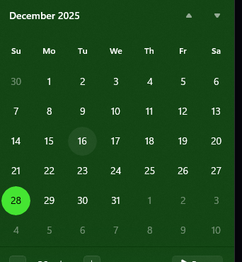

# Instrucciones del cliente  
Crear un programa donde se pueda hacer la nomina de manera más rápida, de lunes a sábado se paga $40 la hora y el domingo se paga $50 la hora.

Algunos trabajadores entran y salen varias veces al día, solo debe pagárseles las horas trabajadas.

El jefe multiplica la cantidad de horas trabajadas por cuanto las paga, ejemplo: Entrada a las 8:15 y salida a las 16:02 lo que el jefe hace es sacar la diferencia en minutos (en este caso de 12) y en este caso salió a una hora más temprana que a la que entro por lo tanto saca la diferencia restando 60 a la diferencia (60 – 12 = 48) y el resultado lo divide entre 60, convirtiendo así los minutos trabajados de estar en base a 60 a estar en base a 100 (48/60 = 0.8), después saca la diferencia en horas pero como el trabajador entro a las 8 se recorre y se hace la cuenta como si hubiera entrado a las 9 (16 – 9 = 7), y por último suma las 2 diferencias finales y eso son las horas trabajadas en ese día(7 + 0.8 = 7.8), ya al final se multiplican las horas trabajadas ese día por lo que paga (7.8 * 40 = 312 si es entre semana o 7.8 *50 = 390). 

Lo que ocupo es que solo tengamos que ingresar la hora de entrada y luego la hora de salida al código y que este nos diga el salario.

La ultima vez que lo hice fue de 3 semanas 1-21 Dic y lo que sacaba de lo que se trabaja de lunes a sábado lo sume con lo que hicieron el Domingo, al final sume los totales de las 3 semanas y eso seria su pago mensual por así decirlo.

# Cosas por hacer:

1. Entregar un PDF con el siguiente formato:    
   Día/Mes/Año: Entrada-Salida  Horas  Sueldo   
   Día/Mes/Año: Entrada-Salida  Horas  Sueldo   
   Día/Mes/Año: Entrada-Salida  Horas  Sueldo

2. Dependiendo del número de semenas del periodo, hacer un tipo tabla semejante a el widget del calendario.

        
    

3. Guardar de alguna forma cada usuario y sus registros de chamba en JSON.
4. Poder crear, editar, leer y borrar usuarios (SOFT DELETE).

src/
└── main/
    └── java/
        └── com/
            └── albalatro/
                │
                ├── Main.java                <-- Punto de entrada (extiende Application)
                │
                ├── 📦 controller/           <-- EL CEREBRO (Conecta FXML con Java)
                │   ├── MainController.java
                │   └── EmpleadoDetalleController.java (Lógica del calendario)
                │
                ├── 📦 model/                <-- LOS DATOS (Lógica pura, sin UI)
                │   ├── Empleado.java        <-- POJO (Nombre, ID, pagoPorHora)
                │   └── RegistroHoras.java   <-- Clase para manejar las fechas/horas
                │
                └── 📦 service/              <-- LA MAQUINARIA (Cálculos y JSON)
                    ├── JsonService.java     <-- Usa Jackson para guardar/leer .json
                    └── NominaService.java   <-- Calcula sueldos e impuestos

src/
└── main/
    └── resources/
        ├── 🖼️ view/                 <-- TUS PANTALLAS (.fxml)
        │   ├── MainView.fxml        (Lista de empleados)
        │   └── EmpleadoView.fxml    (Vista individual con Calendario)
        │
        ├── 🎨 css/                  <-- ESTILOS
        │   └── styles.css           (Para poner bonitos los cuadritos del calendario)
        │
        └── 📷 images/               <-- ICONOS
                └── user_placeholder.png